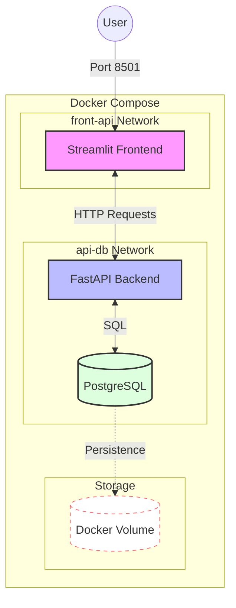

# Project 2: Orchestration, Security and Continuous Delivery (CD)

This second project takes your “Toolbox” to the next level. You will transform your Python script into a complete, secure, and automatically deployable **micro‑services architecture**.

## 1. Project Objectives

* **Orchestration**: Manage several services (Front, API, DB) simultaneously.
* **Persistence**: Handle data with PostgreSQL and Docker volumes.
* **Security**: Master environment variables and secret‑leak detection.
* **Delivery (CD)**: Automate the creation and storage of your images on DockerHub.

## 2. Target Architecture

Your application must be composed of three distinct services:

1. **Frontend (Streamlit)**: User interface (Page 0: Input / Page 1: Display).
2. **API (FastAPI)**: The brain that processes requests and communicates with the DB.
3. **Database (PostgreSQL)**: Persistent data storage.

>Each part has its own `pyproject.toml` (API and Frontend). The database will be launched from its official Docker image.

---

## 3. Development Steps

### Phase A: Business Logic (Local)

* [ ] **Test SQLite**: Develop your `sqlalchemy` module so it first works on a local SQLite database.
* [ ] **FastAPI API**: Create two routes: `POST /data` (save) and `GET /data` (retrieve).
* [ ] **Business logic**: Separate your code inside the API folder (maths, connection, crud, data).
* [ ] **Streamlit Frontend**: Build the two required pages.
* [ ] **Tests**: Validate your API with Pytest (maths and API).

>**Be careful** not to version the SQLite database.

Since we only test the API, you can configure the API’s `pyproject.toml` so it knows the test path:

```toml
[tool.pytest.ini_options]
# Force pytest to consider the app_api folder as a source
pythonpath = ["."]
testpaths = ["tests"]
```

Tests can be run from the project root with:

```bash
uv run pytest app_api/tests
```

### Phase B: Environment Variables and Hygiene

* [ ] **Extraction**: Move URLs, logins, and passwords out of your code.
* [ ] **File management**:
* `.env` — Contains your secrets (excluded by `.gitignore`).
* `.env.example` — Empty template explaining which variables are required.
* `.dockerignore` — Prevents sending `.env`, `.venv`, and `__pycache__` into your images.

---

### Phase C: Docker Compose Orchestration (local testing)

* [ ] **Networks**: Create two networks:
  * `front-api` — For Streamlit <-> FastAPI communication.
  * `api-db` — For FastAPI <-> PostgreSQL communication (**the DB must be invisible to the Front**).

* [ ] **Volumes**: Configure a volume so PostgreSQL data persists across container restarts.  
  Test by stopping and restarting services, then checking in Streamlit that the data is still there.

---

### Approximate Architecture Diagram (Docker Orchestration)



## 4. Automation and Distribution (GitHub & DockerHub)

### Improved CI (Gitleaks)

Update your `.github/workflows/ci.yml` if needed, then:

* Add a **Gitleaks** scan (`security.yml`) to ensure no secret is present in your Git history.
* **Challenge**: Intentionally push a variable in a commit, observe the CI failure, then clean your history.

---

### Continuous Delivery (CD)

Create a new workflow `.github/workflows/cd.yml`:

* **Trigger**: Only if the CI is **Green** on the `main` branch.
* **Action**: Log in to DockerHub using **GitHub Secrets**.
* **Versioning**: Build and push your images with two tags:
  * the Git commit hash `${{ github.sha }}`
  * the tag `latest`  
  This allows you to roll back to a previous container if needed.

```yaml
steps:
  - name: Build and Push
    uses: docker/build-push-action@v5
    with:
      context: ./app_api
      push: true
      tags: |
        ${{ secrets.DOCKERHUB_USERNAME }}/my-api:latest
        ${{ secrets.DOCKERHUB_USERNAME }}/my-api:${{ github.sha }}
```

To ensure CD runs only after CI succeeds, add this condition in cd.yml:

```yaml
on:
  workflow_run:
    workflows: ["CI Standardisation Projet 1"] # Must match the 'name' in ci.yml
    types:
      - completed
    branches:
      - main
```

This way, CD runs only when CI is green.

### Final Orchestration

Create the production compose file: **`docker-compose.prod.yml`**, which does **not** build images but instead pulls the **latest** versions of your images from DockerHub.  
Share your code with another group and test that everything works correctly.

---

## 5. Final Repository Structure
```plaintext
.
├── .github/
│   ├── workflows/
│   │   ├── ci.yml               # Linting, Tests, Gitleaks
│   │   └── cd.yml               # Build & Push to DockerHub
│   ├── CONTRIBUTING.md
│   └── CODE_OF_CONDUCT.md
├── app_front/                   # Streamlit Service
│   ├── main.py
│   ├── pages
│   │   ├── 0_insert.py
│   │   └── 1_read.py
│   ├── pyproject.toml
│   ├── uv.lock
│   └── Dockerfile
├── app_api/                     # FastAPI Service
│   ├── Dockerfile
│   ├── pyproject.toml
│   ├── uv.lock
│   ├── models/                  # Pydantic models
│   │   ├── __init__.py
│   │   └── models.py
│   ├── modules/                 # Project 1 logic
│   │   ├── __init__.py
│   │   ├── connect.py           # Connection and CRUD operations
│   │   └── crud.py              # CRUD operations
│   ├── maths/                   # Project 1 logic
│   │   ├── __init__.py
│   │   └── mon_module.py        # add, sub, square, print_data
│   ├── data/                    # Project 1 data
│   │   └── moncsv.csv
│   └── main.py                  # Application entry point
├── tests/
│   ├── test_api.py
│   └── test_math_csv.py
├── docker-compose.yml           # Dev (build: .)
├── docker-compose.prod.yml      # Prod (image: user/repo:tag)
├── conftest.py
├── .gitignore
├── .dockerignore
└── .env.example
```

---
## 6. Expected Deliverables

* [ ] A GitHub repository with all badges (CI, Coverage) green.
* [ ] A `docker-compose.prod.yml` file that launches your full application using only images pulled from DockerHub.
* [ ] Proof that Gitleaks is active in your security pipeline.
