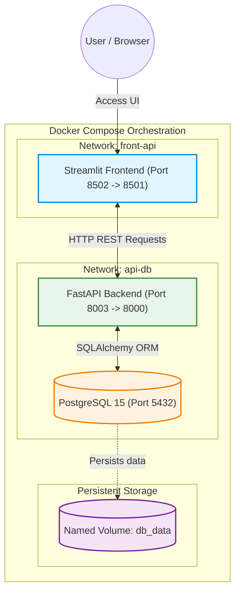

# SIDORA AI — MLOps Microservices Platform

[](https://github.com/KBee-data/PROJET-2_Orchestration/actions/workflows/ci.yml)
[](https://kbee-data.github.io/PROJET-2_Orchestration/)
[](https://github.com/KBee-data/PROJET-2_Orchestration/actions/workflows/security.yml)
[](https://github.com/KBee-data/PROJET-2_Orchestration)
[](https://github.com/astral-sh/ruff)
[](https://www.python.org/)
[](https://github.com/astral-sh/uv)

---

## 📌 Project Overview

This project transforms a raw Machine Learning algorithm into an enterprise-grade, secure, documented, and fully containerized microservices platform for **SIDORA AI**.

### Key Highlights:
- **Microservices Architecture**: Segregated **FastAPI** backend, **Streamlit** multi-page frontend, and a persistent **PostgreSQL** database.
- **Strict Network Isolation**: Distinct internal Docker networks (`front-api` and `api-db`) ensuring the database is completely unreachable from the frontend.
- **100% Code Coverage**: Comprehensive unit and integration test suite using ephemeral in-memory SQLite (`StaticPool`) and `pytest-cov`.
- **Automated Documentation**: Full Google-style DocStrings extracted into static HTML using **Sphinx Autodoc** and continuously deployed to **GitHub Pages**.
- **Container Optimization**: Multi-stage Docker builds discarding C compiler toolchains (`gcc`, `libpq-dev`), minimizing production image size.
- **Automated CI/CD**: GitHub Actions workflows validating linting (`ruff`), secret leakage detection (`gitleaks`), tests with coverage threshold, and automated DockerHub delivery.

---

## 📚 Online Documentation

The official API and architecture documentation generated by Sphinx autodoc is hosted live on GitHub Pages:

👉 **[View Sphinx Documentation on GitHub Pages](https://kbee-data.github.io/PROJET-2_Orchestration/)**

---

## 🏗️ Architecture & Orchestration



---

## ⚡ Quickstart & Local Installation (< 2 minutes)

This project uses [**`uv`**](https://github.com/astral-sh/uv), the extremely fast Python package manager.

### 1. Clone the Repository
```bash
git clone https://github.com/KBee-data/PROJET-2_Orchestration.git
cd PROJET-2_Orchestration
```

### 2. Environment Setup
Copy the environment template:
```bash
cp .env.example .env
```

### 3. Install Dependencies with `uv sync`
Both microservices use independent virtual environments and lockfiles:

```bash
# Install API dependencies, development tools, and Sphinx docs
uv sync --project app_api

# Install Frontend dependencies
uv sync --project app_front
```
*Installation completes in under 10 seconds thanks to `uv`'s fast resolution and caching.*

---

## 🧪 Testing & Code Quality

All tests run against a hermetic, in-memory SQLite database (`sqlite:///:memory:`) using SQLAlchemy's `StaticPool`. No SQLite `.db` files are ever written to disk.

### Run Tests with Coverage Report (>80% requirement)
```bash
uv run --project app_api pytest
```
*Output: **100% code coverage** across all modules with line-by-line validation.*

### Run Code Quality & Formatting Checks (Ruff)
```bash
# API linting & formatting checks
uv run --project app_api ruff check .
uv run --project app_api ruff format --check .

# Frontend linting & formatting checks
uv run --project app_front ruff check .
uv run --project app_front ruff format --check .
```

---

## 📖 Local Sphinx Documentation Build

To build the HTML documentation locally:
```bash
uv run --project app_api sphinx-build -b html docs docs/_build/html
```
Open `docs/_build/html/index.html` in your browser to view the generated site.

---

## 🐳 Running with Docker Compose

### Development Environment (Local Multi-Stage Build)
To build the multi-stage images and start all three services simultaneously:
```bash
docker-compose up --build
```

### Services Access:
| Service | URL | Description |
| :--- | :--- | :--- |
| **Streamlit Frontend** | [http://localhost:8502](http://localhost:8502) | Multi-page UI (Page 0: Saisie / Page 1: Affichage) |
| **FastAPI Backend** | [http://localhost:8003](http://localhost:8003) | REST API root health check |
| **Swagger Interactive Docs** | [http://localhost:8003/docs](http://localhost:8003/docs) | OpenAPI interactive documentation and testing |
| **PostgreSQL Database** | Internal network `api-db` | Isolated storage with persistent volume `db_data` |

### Production Environment (Pre-built DockerHub Images)
```bash
docker-compose -f docker-compose.prod.yml up
```

---

## 🔄 CI/CD & Security Pipelines

Automated GitHub Actions workflows ensure enterprise reliability:

| Workflow | File | Triggers | Responsibilities |
| :--- | :--- | :--- | :--- |
| **CI** | [`.github/workflows/ci.yml`](.github/workflows/ci.yml) | Push & PR (`main`, `develop`) | Ruff linting, Ruff formatting check, Pytest coverage (>80%), Multi-stage Docker build validation |
| **Documentation** | [`.github/workflows/docs.yml`](.github/workflows/docs.yml) | Push (`main`, `develop`) | Builds Sphinx HTML from DocStrings and deploys live to **GitHub Pages** |
| **Security** | [`.github/workflows/security.yml`](.github/workflows/security.yml) | Push & PR | Scans git history with **Gitleaks** to detect secret leaks |
| **CD** | [`.github/workflows/cd.yml`](.github/workflows/cd.yml) | On CI success on `main` | Builds and pushes versioned images (`latest` and `SHA`) to **DockerHub** |

---

## 📁 Repository Structure

```plaintext
.
├── .github/
│   └── workflows/
│       ├── ci.yml                 # Ruff, Coverage tests, Docker build check
│       ├── cd.yml                 # DockerHub automated push
│       ├── docs.yml               # Sphinx -> GitHub Pages automated deployment
│       └── security.yml           # Gitleaks secret scanning
├── docs/                          # Sphinx documentation source
│   ├── conf.py                    # Sphinx autodoc & napoleon configuration
│   ├── index.rst                  # Documentation homepage & toctree
│   └── modules.rst                # API reference specifications
├── app_api/                       # FastAPI Backend Service
│   ├── Dockerfile                 # Optimized multi-stage Dockerfile
│   ├── pyproject.toml             # uv dependencies & pytest coverage config
│   ├── uv.lock                    # Cryptographically locked dependencies
│   ├── main.py                    # REST API endpoints & lifespan
│   ├── models/                    # SQLAlchemy ORM models
│   ├── modules/                   # CRUD logic and database connection
│   ├── maths/                     # Core business / math algorithms
│   └── tests/                     # Hermetic in-memory test suite (100% coverage)
├── app_front/                     # Streamlit Frontend Service
│   ├── Dockerfile                 # Multi-stage Streamlit Dockerfile
│   ├── pyproject.toml             # Frontend uv dependencies
│   ├── uv.lock                    # Frontend dependency lockfile
│   ├── main.py                    # Streamlit home landing page
│   └── pages/
│       ├── 0_insert.py            # Data input page
│       └── 1_read.py              # Data table & visualization page
├── docker-compose.yml             # Local multi-service orchestration (build: .)
├── docker-compose.prod.yml        # Production orchestration (image: user/repo)
├── .dockerignore                  # Strict exclusion of .env, .venv, *.db, cache
├── .gitignore                     # Git exclusion rules
├── .env.example                   # Environment variable template
└── README.md                      # Comprehensive project documentation
```

---

## 👥 Authors & Certification

- **Candidate**: Développeur IA chez SIDORA AI
- **Certification**: [2023] Certification RNCP Développeur.se en intelligence artificielle
- **Project**: MLOps Projet 2 — Orchestration, Sécurité et Livraison Continue (CD)
